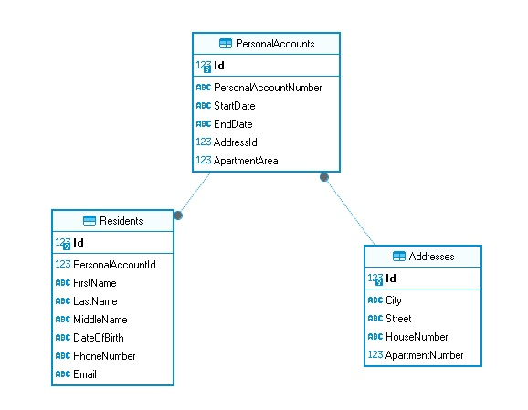

## PersonalAccount Manager
PersonalAccount manager is a WebAPI for personal account database management. It implements CRUD operations for PersonalAccount entity and field validation.

Also includes APIs for:
1. Retrieving all personal accounts;
2. Retrieving personal accounts with residents;
3. Searching for personal accounts avaliable on a specific date;
4. Searching for personal accounts by a resident's full name;
5. Searching for personal accounts by an address.

The database schema:

